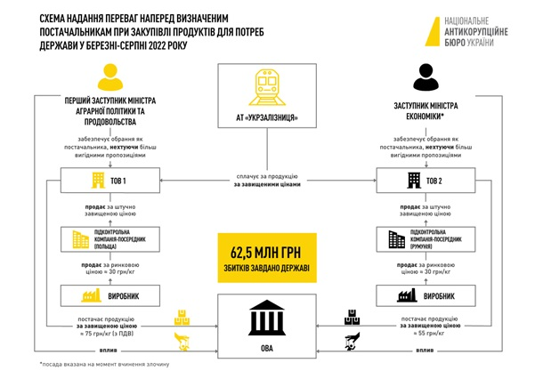

# Реєстр злочинів

## Під час масової евакуації у 2022 році топчиновники вкрали на продуктах Укрзалізниці понад 62 млн гривень. 

 Національне антикорупційне бюро України та Спеціалізована антикорупційна прокуратура викрили першого заступника міністра аграрної політики та колишнього заступника міністра економіки у зловживанні на суму 62,5 млн гривень під час закупівлі продуктів харчування для забезпечення потреб держави в період воєнного стану. Про це 24 серпня повідомила пресслужба НАБУ.
 
Зловживання викрито під час закупівлі АТ Укрзалізниця продуктів харчування для надання гуманітарної допомоги мешканцям Донецької, Херсонської, Сумської, Запорізької, Київської, Хмельницької, Дніпропетровської та Полтавської областей і міста Києва.
 
Схему у березні 2022 року реалізував перший заступник міністра аграрної політики та продовольства. Вона передбачала закупівлю для потреб обласних військових адміністрацій коштом Укрзалізниці продукції у підконтрольної компанії за цінами, у 2-3 рази вищими за ринкові. Завищення ціни відбулося за рахунок закупівлі продукції у Польщі через контрольовану фірму-посередницю.
 
Внаслідок реалізації цієї оборудки з березня по серпень 2022 року Укрзалізниці заподіяно збитки в сумі 28,8 млн гривень.
 
За участі того самого посадовця у той самий період за завищеними цінами були закуплені продукти харчування для потреб держави у іншої підконтрольної компанії, яка через підконтрольну фірму-посередницю також закуповувала продукцію на цей раз у Туреччині за ринковими цінами. Як і у першому епізоді, підвищення ціни відбувалось саме на етапі продажу продукції однією підконтрольною компанією іншій.

 Фото: НАБУ
 
До цієї схеми залучили чинного на той момент заступника міністра економіки. Він, зокрема, приховував дані про наявність більш вигідних пропозицій від інших учасників ринку, включно з українськими виробниками, а також схиляв посадовців ОВА до погодження заявок та рахунків на закупівлю продуктів у підконтрольної компанії. Після отримання оплати гроші виводились на закордонну компанію з ознаками фіктивності для подальшої легалізації.
 
Через дію цієї схеми з березня по серпень 2022 року Укрзалізниці заподіяно збитки в сумі 33,7 млн гривень.
 
Наразі про підозру повідомлено двом особам: першому заступнику міністра аграрної політики та продовольства, а також  ексзаступнику міністра економіки. Їх підозрюють у зловживанні владою або службовим становищем. Вирішується питання щодо обрання підозрюваним запобіжних заходів. 

